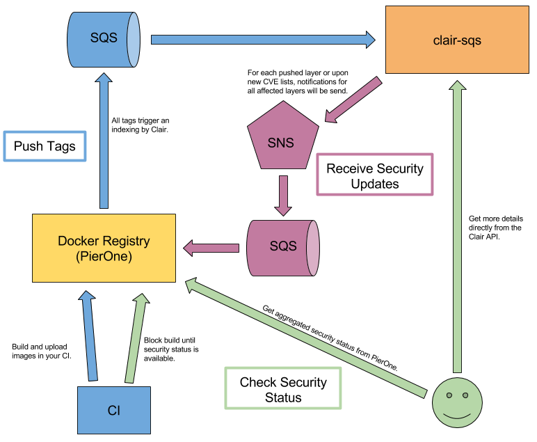

# Clair w/ SQS

[CoreOS' Clair](https://github.com/coreos/clair) is a tool to check your rkt and Docker images for
security vulnerabilities. This repository contains a special distribution of Clair that uses SQS to
trigger the analysis of your container images and only provides protected read access to Clair's
API.

## Concept

The `clair-sqs` container takes "layer pushes" via SQS and provides notifications via SNS (which
can then again forward the notification to an SQS queue if you like). For that, two sidecars are
deployed next to Clair:

* `receiver`
  * The receiver listens on an SQS queue and forwards messages to `POST /v1/layers` in Clair.
* `sender`
  * The sender receives notifications from Clair via a local webhook, fetches the notification
    details and sends those details to an SNS topic.

In addition, `skipper` is added as a sidecar to provide read-only access to Clair's API. This
allows you to provide all detailed information to your users without exposing the capability to
insert fake layers.

## Usage

As soon as you have `clair-sqs` running, you can push layers to clair and receive reports about your layers. The message
format is exactly as described in Clair's documentation for the `/v1/layers` semantic:

* To push layers, send a JSON message to SQS with the same structure as you would send to
  [POST /v1/layers](https://github.com/coreos/clair/blob/master/api/v1/README.md#post-layers).
* Each time, a layer was analysed or vulnerabilities might have changed, you will get an SNS notification with a JSON
  message that is the same as
  [GET /v1/layers/:name](https://github.com/coreos/clair/blob/master/api/v1/README.md#get-layersname).

## Configuration

This Docker container is configured via environment variables that are the following:

* `CLAIR_DATABASE_SOURCE`
  * The database source definition. For PostgreSQL as described here:
    [http://www.postgresql.org/docs/9.4/static/libpq-connect.html](http://www.postgresql.org/docs/9.4/static/libpq-connect.html).
* `CLAIR_API_PAGINATIONKEY`
  * 32-bit URL-safe base64 key used to encrypt pagination tokens. If one is not provided, it will
    be generated. Multiple clair instances in the same cluster need the same value.
* `RECEIVER_QUEUE_URL`
  * The URL of the SQS queue you want to read "layer push" messages from.
* `RECEIVER_QUEUE_REGION`
  * The region of your SQS queue. (for feedback on new layers)
* `RECEIVER_TOPIC_ARN`
  * The ARN of the SNS topic you want to receive notifications on.
* `RECEIVER_TOPIC_REGION`
  * The region of your SNS topic.
* `SENDER_TOPIC_ARN`
  * The ARN of the SNS topic you want to receive notifications on. (for feedback on new CVEs)
* `SENDER_TOPIC_REGION`
  * The region of your SNS topic.

## Building

    docker build -t clair-sqs .

## Running locally

Run a local PostgreSQL database:

    docker run -d --name postgres postgres:9.4

Figure out the linked IP of PostgreSQL:

    docker run --link postgres ubuntu env | grep POSTGRES_PORT_5432_TCP_ADDR

Run `clair-sqs`:

    docker run -it --link postgres \
        -p 8080:8080 \
        -p 6060:6060 \
        -v $HOME/.aws:/root/.aws \
        -e CLAIR_DATABASE_SOURCE=postgres://172.17.0.2:5432/postgres\?user=postgres\\\&sslmode=disable \
        -e RECEIVER_QUEUE_URL=https://sqs.eu-central-1.amazonaws.com/1234567890/clair-layers \
        -e RECEIVER_QUEUE_REGION=eu-central-1 \
        -e RECEIVER_TOPIC_ARN=arn:aws:sns:eu-central-1:1234567890:clair-notifications \
        -e RECEIVER_TOPIC_REGION=eu-central-1 \
        -e SENDER_TOPIC_ARN=arn:aws:sns:eu-central-1:1234567890:clair-notifications \
        -e SENDER_TOPIC_REGION=eu-central-1 \
        clair-sqs

Port `8080` provides readonly access to the Clair API and port `6060` provides raw Clair API
access. For production usage, you want to also specify the `CLAIR_API_PAGINATIONKEY`
configuration.

Now you can index a Docker image by extracting the layers and pushing the information to SQS:

    tools/index-image.sh \
        https://sqs.eu-central-1.amazonaws.com/1234567890/clair-layers eu-central-1 \
        registry.opensource.zalan.do \
        stups ubuntu 15.10-16

## License

The MIT License (MIT) Copyright © 2016 Zalando SE, https://tech.zalando.com

Permission is hereby granted, free of charge, to any person obtaining a copy of this software and
associated documentation files (the “Software”), to deal in the Software without restriction,
including without limitation the rights to use, copy, modify, merge, publish, distribute,
sublicense, and/or sell copies of the Software, and to permit persons to whom the Software is
furnished to do so, subject to the following conditions:

The above copyright notice and this permission notice shall be included in all copies or
substantial portions of the Software.

THE SOFTWARE IS PROVIDED “AS IS”, WITHOUT WARRANTY OF ANY KIND, EXPRESS OR IMPLIED, INCLUDING
BUT NOT LIMITED TO THE WARRANTIES OF MERCHANTABILITY, FITNESS FOR A PARTICULAR PURPOSE AND
NONINFRINGEMENT. IN NO EVENT SHALL THE AUTHORS OR COPYRIGHT HOLDERS BE LIABLE FOR ANY CLAIM,
DAMAGES OR OTHER LIABILITY, WHETHER IN AN ACTION OF CONTRACT, TORT OR OTHERWISE, ARISING FROM, OUT
OF OR IN CONNECTION WITH THE SOFTWARE OR THE USE OR OTHER DEALINGS IN THE SOFTWARE.
